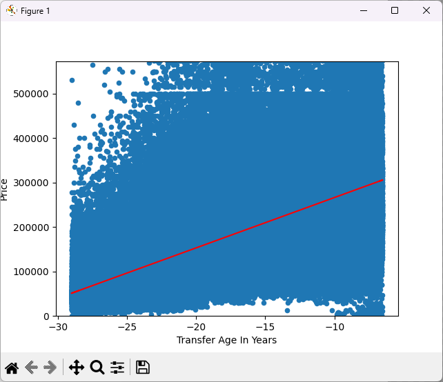

# UK House Pricing Machine Learning
Small project to experiment with *python*, *pandas*, *numpy* and *sci-kit learn*.

Only a sample of the dataset is included in this repo. Full dataset can be found on Kaggle [here](https://www.kaggle.com/datasets/hm-land-registry/uk-housing-prices-paid?resource=download)

## take-sample.py
This generates a sample file from the full dataset and puts it in [data/sample.csv](data/sample.csv).

A sample file is already included, but *take-sample.py* can be re-run with different parameters if required. Note that you'll need the full dataset from Kaggle to do so.

## filtering.py
Filters a CSV file to a subset and stores the output in a new csv file.
Currently set up to filter to only _BRISTOL_ records.

Example usage:
`python filtering.py --input data/sample.csv --output data/bristol.csv`

## linear-regression-on-age.py
Runs linear regression on the sample dataset and plots the result.

Example usage:
`python linear-regression-on-age.py --input data/bristol.csv`

Example output:

```
Working with file .\data\bristol.csv...
Coefficients: [11325.83413437]
Intercept: 379706.664923784
Prediction for a house sold 30 years ago is     £39,932
Prediction for a house sold 20 years ago is     £153,190
Prediction for a house sold 10 years ago is     £266,448
Prediction for a house sold in 2024 is          £379,707
```

Example figure:

